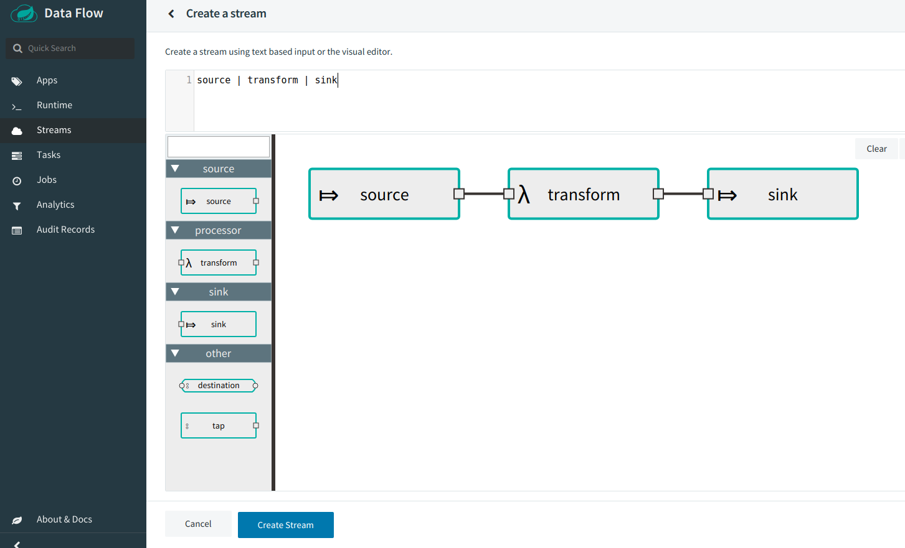

### basic scdf pipeline

- First you need to clone the repository
  ```
  git clone https://github.com/cahlen/basic-scdf-pipeline.git
  ```

- Use docker-compose to deploy the stream
  ```
  cd basic-scdf-pipeline
  docker-compose up -d
  ```

- Register the applications using the following shell script so that
you can create the stream (give it a few minutes to boot up the docker-compose environment)
  ```
  ./tools/register-apps.sh
  ```

- To create the stream in the Spring Cloud Data Flow UI point your browser
to the following URI
  ```
  http://localhost:9393/dashboard
  ```
  
  
- Deploy the stream
- Point your web browser to the mongo-express UI at
  ```
  http://localhost:8889 
  ```
  And choose the `test` database and the `starbucks` collection within that 
  database to view the results.
  
